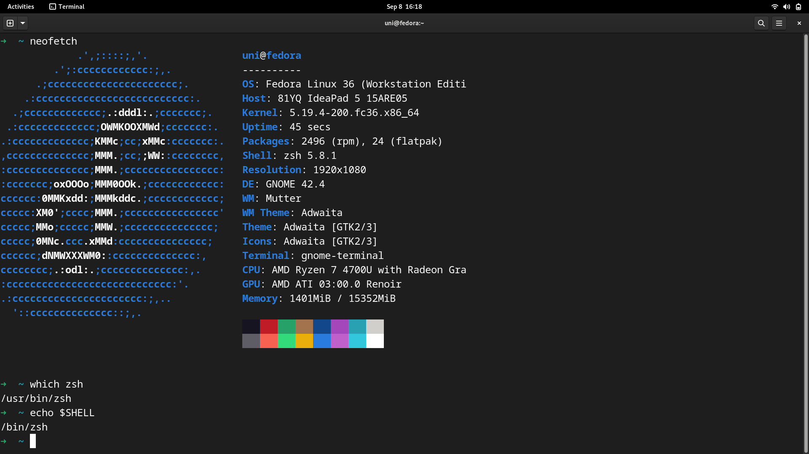
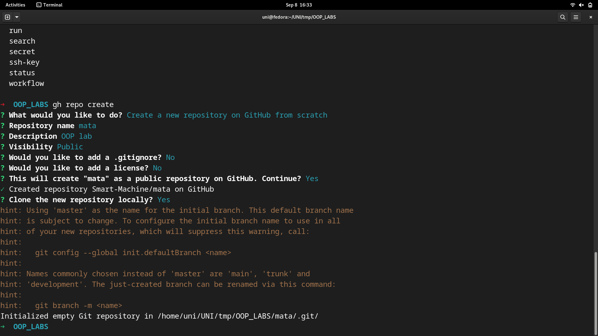
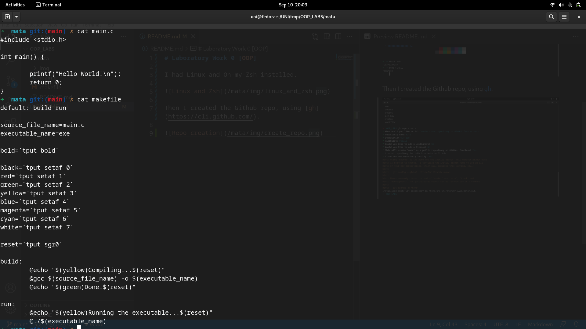
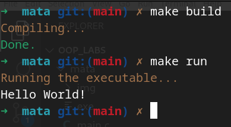
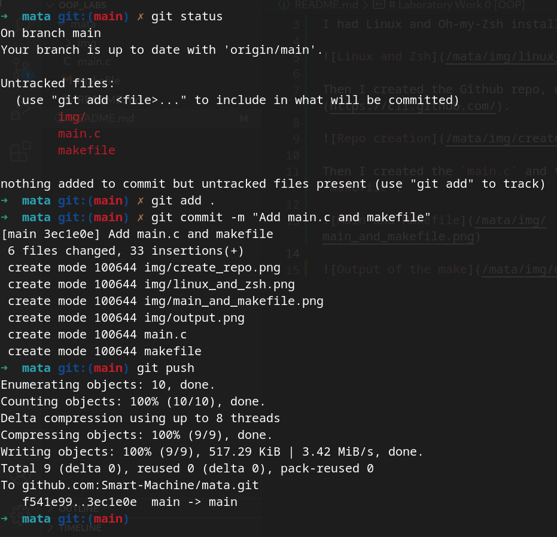

# Laboratory Work 0 [OOP]

I had Linux and Oh-my-Zsh installed. 

Then I created the Github repo, using [gh](https://cli.github.com/).

Then I created the `main.c` and the `makefile`. 

Then I pushed everything to the remote repo.

